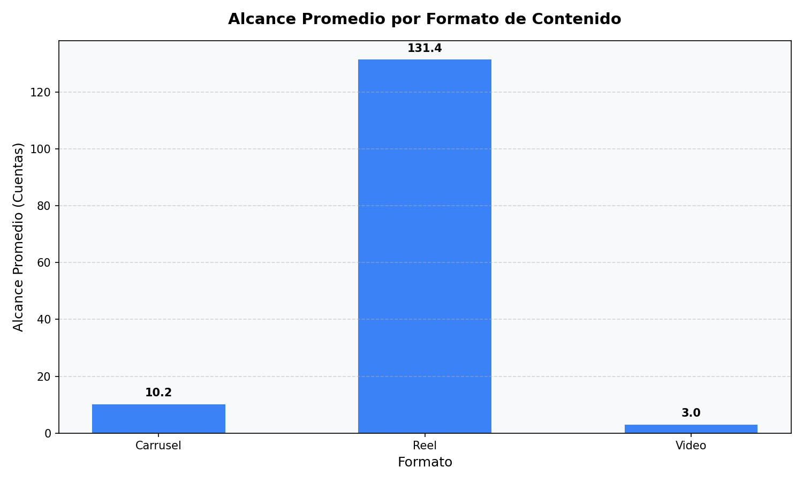
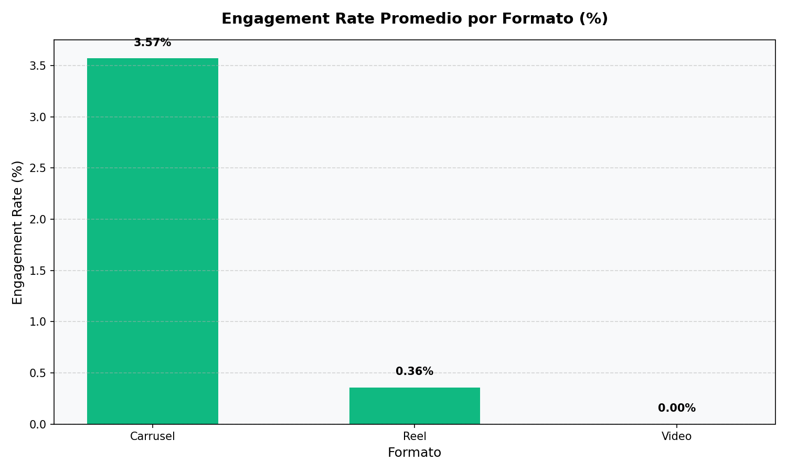
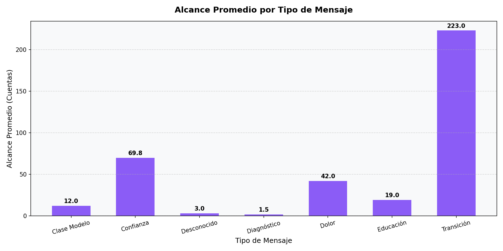
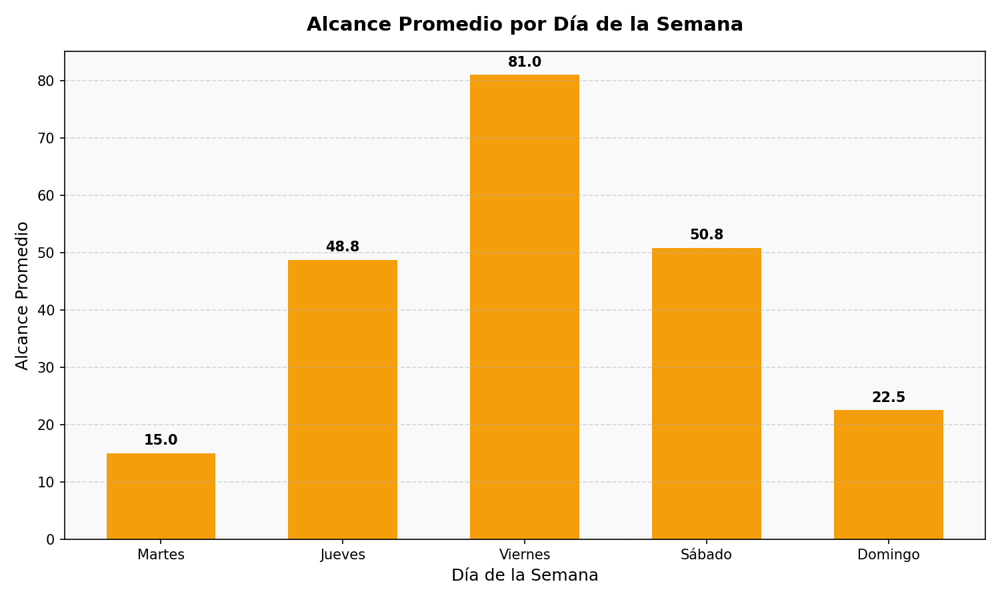
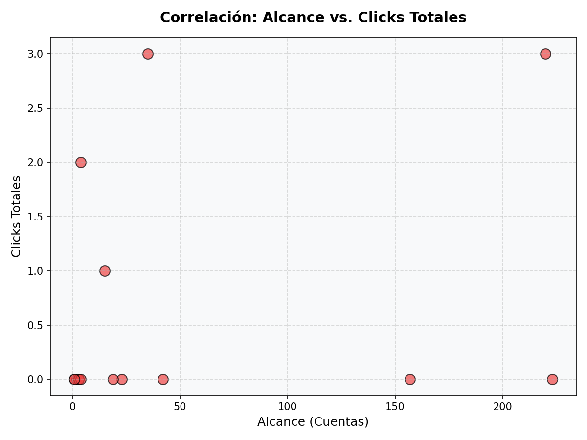

# Análisis de Desempeño Orgánico en Meta (Junio 2026)

Este reporte presenta el diagnóstico inicial y el análisis de rendimiento de las publicaciones de la página de **Centro de Tutorías** correspondientes a las métricas reales del periodo del 1 al 28 de junio de 2026.

---

## 1. Diagnóstico de Datos y Estructura de Reportes

Al analizar los archivos disponibles en el directorio `REPORTES META`, identificamos dos archivos con idéntico tamaño y contenido (`Jun-01-2026_Jun-28-2026_1762005678309529.csv` y `Jun-01-2026_Jun-28-2026_4074952845974288.csv`). Ambos contienen las mismas 15 publicaciones ordenadas de forma distinta.

### Columnas Disponibles y Calidad de la Información
Las columnas principales del reporte se clasifican de la siguiente manera:
1. **Identificadores y Metadatos**: `Identificador de la publicación`, `Identificador de la página`, `Nombre de la página`, `Título`, `Hora de publicación`, `Enlace permanente`.
   * *Nota:* La columna `Título` contiene el texto descriptivo (copy) de la publicación, y la columna `Descripción` está vacía (NaN).
2. **Clasificación en Origen**: `Tipo de publicación` (valores: *Fotos* y *Videos*), `Duración (segundos)` (para videos).
3. **Métricas de Alcance y Visualizaciones**: `Alcance` (cuentas únicas) y `Visualizaciones` (impresiones/reproducciones).
4. **Métricas de Interacción**: `Reacciones`, `Comentarios`, `Veces que se compartió`.
5. **Métricas de Clics**: `Total de clics`, `Clics en el enlace`, `Consumo de segmentación del público coincidente (Photo Click)`, `Clics de otro tipo`.
6. **Métricas de Video**: `Segundos reproducidos`, `Segundos en promedio reproducidos`.
7. **Vacías / Sin Datos**: `Tipo de subtítulo`, `Idiomas`, `Etiquetas personalizadas`, `Estado de contenido financiado`, `Comentario sobre los datos`, `Ingresos estimados (USD)`, `CPM del anuncio (USD)`, `Impresiones del anuncio`.

---

## 2. Resumen Ejecutivo (Métricas Clave)

Durante este mes, se contabilizaron **15 publicaciones** orgánicas con los siguientes resultados globales:

*   **Alcance Total**: 752 cuentas únicas
*   **Visualizaciones Totales**: 875
*   **Interacciones Totales**: 12 (Reacciones: 6 | Comentarios: 0 | Compartidos: 6)
*   **Clics Totales**: 9
*   **Engagement Rate Promedio (por post)**: 2.26%
*   **CTR Promedio (Clics / Alcance)**: 4.44%

---

## 3. Comparación por Formato de Contenido

El rendimiento varía significativamente entre formatos. Hemos clasificado las publicaciones en **Reel** (videos con enlace de tipo reel y duración > 0), **Video** (videos de duración 0) y **Carrusel** (publicaciones del tipo Fotos que constan de múltiples imágenes según nuestro generador diario).

| Formato | Cantidad de Posts | Alcance Promedio | Visualizaciones Promedio | Interacciones Promedio | Clics Promedio | Engagement Rate (%) | CTR (%) |
| :--- | :---: | :---: | :---: | :---: | :---: | :---: | :---: |
| **Reel** | 5 | **131.4** | 139.0 | 0.80 | **0.80** | 0.36% | 1.61% |
| **Carrusel** | 9 | 10.2 | 19.0 | **0.89** | 0.56 | **3.57%** | **6.51%** |
| **Video** | 1 | 3.0 | 9.0 | 0.00 | 0.00 | 0.00% | 0.00% |

### Gráficos de Rendimiento por Formato

### Hallazgos Clave por Formato:
1. **El Algoritmo Premia los Reels**: Los Reels logran un alcance promedio **12.8 veces mayor** que los carruseles orgánicos. La distribución algorítmica favorece fuertemente el formato vertical rápido.
2. **Los Carruseles Generan Calidad y Clics**: A pesar de su alcance limitado (10.2 de alcance promedio), los carruseles logran una tasa de interacción mucho más alta (**3.57% vs 0.36%**) y un CTR de **6.51%**. Esto demuestra que el público que ve los carruseles está altamente calificado e interesado en el contenido pedagógico visual.

---

## 4. Comparación por Tipo de Mensaje

Hemos clasificado el contenido de acuerdo con la estrategia de comunicación y los dolores atacados:

| Tipo de Mensaje | Cantidad | Alcance Promedio | Interacciones Promedio | Total Clics | Engagement Promedio | CTR Promedio |
| :--- | :---: | :---: | :---: | :---: | :---: | :---: |
| **Transición (Universidad)** | 1 | **223.0** | **3.0** | 0 | 1.35% | 0.00% |
| **Confianza (Autoestima/Miedo)** | 6 | 69.8 | 0.5 | **6** | 1.83% | **9.67%** |
| **Dolor (Tareas/Estrés)** | 1 | 42.0 | 0.0 | 0 | 0.00% | 0.00% |
| **Educación (Enfoque/Pedagogía)** | 2 | 19.0 | 1.5 | 3 | 4.29% | 4.29% |
| **Clase Modelo (Conversión)** | 2 | 12.0 | 1.5 | 0 | **6.52%** | 0.00% |
| **Diagnóstico (Conversión)** | 2 | 1.5 | 0.0 | 0 | 0.00% | 0.00% |

### Hallazgos Clave por Tipo de Mensaje:
1. **La Confianza es el Imán de Prospectos**: Los posts enfocados en **Confianza y Autoestima** ("Si te dice 'no puedo con mate'", "Recuperar la confianza") acumularon **6 de los 9 clics totales** del mes y el mayor CTR promedio (**9.67%**). Esto indica que los padres de familia reaccionan directamente a la salud emocional y la seguridad académica de sus hijos, más que a la oferta directa de tutorías.
2. **La Transición Universitaria tiene Mayor Tracción**: El post sobre la transición al primer año de universidad ("La universidad cambia el ritmo, pero no tiene que enfrentarlo solo") obtuvo el mayor alcance individual (**223 cuentas**), sugiriendo que la angustia por los primeros semestres universitarios (cálculo y física) es un área de alto interés orgánico.

---

## 5. Ranking de Publicaciones (Top & Bottom)

### Top 5 Publicaciones por Alcance e Impacto

1.  **ID: 1310081584652279 (Reel - Transición)**
    *   *Alcance:* 223 | *Visualizaciones:* 238 | *Interacciones:* 3 (1 reacción, 2 compartidos) | *Clics:* 0
    *   *Copy:* "La universidad cambia el ritmo, pero no tiene que enfrentarlo solo..."
    *   *Desempeño:* Mayor alcance orgánico del mes.
2.  **ID: 1314667664193671 (Reel - Confianza)**
    *   *Alcance:* 220 | *Visualizaciones:* 232 | *Interacciones:* 1 | *Clics:* 3
    *   *Copy:* "Si te dice 'no puedo con mate', necesita otra forma de explicación..."
    *   *Desempeño:* Excelente balance; gran alcance y generó **3 clics** directos.
3.  **ID: 1313986687595102 (Reel - Confianza)**
    *   *Alcance:* 157 | *Visualizaciones:* 160 | *Interacciones:* 0 | *Clics:* 0
    *   *Copy:* "Recuperar la confianza también es parte de aprender matemática..."
    *   *Desempeño:* Buen alcance de reproducción de video rápido.
4.  **ID: 1316392790687825 (Reel - Dolor)**
    *   *Alcance:* 42 | *Visualizaciones:* 44 | *Interacciones:* 0 | *Clics:* 0
    *   *Copy:* "Cuando las tareas se acumulan, la frustración en casa crece..."
    *   *Desempeño:* Rendimiento moderado enfocado en dolores familiares.
5.  **ID: 1308501324810305 (Carrusel - Educación)**
    *   *Alcance:* 35 | *Visualizaciones:* 65 | *Interacciones:* 3 | *Clics:* 3
    *   *Copy:* "Cada estudiante aprende distinto y merece una explicación diferente..."
    *   *Desempeño:* La publicación con mayor **Engagement Rate del mes (8.57%)** y **3 clics** directos a pesar de ser carrusel.

### Bottom 5 Publicaciones (Menor Rendimiento)

1.  **ID: 1313996817594089 (Carrusel - Diagnóstico)** | *Alcance:* 1
2.  **ID: 1309744574685980 (Carrusel - Clase Modelo)** | *Alcance:* 1
3.  **ID: 1313992947594476 (Carrusel - Diagnóstico)** | *Alcance:* 2
4.  **ID: 1310731574587280 (Carrusel - Educación)** | *Alcance:* 3
5.  **ID: 1310093034651134 (Video - Desconocido)** | *Alcance:* 3 (Este post falló al no tener copy/título asociado).

---

## 6. Análisis Temporal y de Frecuencia

### Rendimiento por Día de la Semana:
*   **Viernes**: Alcance promedio de **81.0 cuentas** (mayor del mes, impulsado por publicaciones a primera hora).
*   **Sábado**: Alcance promedio de **50.8 cuentas** (alto volumen de publicaciones).
*   **Jueves**: Alcance promedio de **48.8 cuentas**.

### Rendimiento por Hora de Publicación:
*   Las horas de mayor efectividad para alcanzar audiencia fueron las **primeras horas de la mañana (6:00 AM - 7:00 AM)** y las **horas de la noche (7:00 PM)**. Las publicaciones al mediodía (11:00 AM - 12:00 PM) obtuvieron un alcance promedio muy bajo (menor a 10 cuentas).

---

## 7. Correlación: Alcance vs. Clics

El análisis de dispersión muestra un patrón de interés:

A nivel orgánico sin pauta:
*   La mayoría de los posts se agrupan en el rango de alcance de **0 a 40 cuentas** con pocos o ningún clic.
*   Sin embargo, hay publicaciones muy eficientes (como el Carrusel de ID `1308501324810305` con solo 35 de alcance y **3 clics**, o el Reel de ID `1314667664193671` con 220 de alcance y **3 clics**).
*   Esto nos indica que la **calidad del copy y el gancho (hook)** tiene mayor correlación con los clics hacia WhatsApp y web que el simple volumen de alcance.
